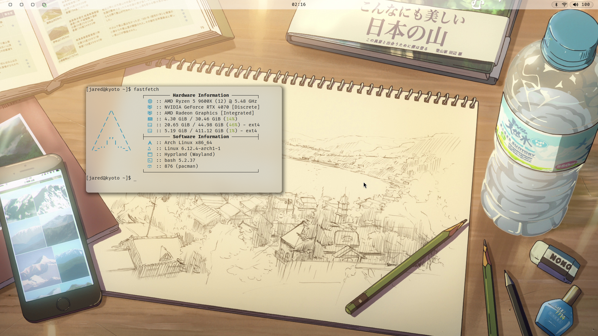

# Arch Linux and Hyprland Config Files

Configuration files for my (desktop) Linux system, which I use for school and coding. Inspired by [this](https://github.com/luyu-wu/Config), among other configs.

## Current State (12/21/24)

## What I Use

-   [alacritty](https://github.com/alacritty/alacritty): a cross-platform, OpenGL terminal emulator.
-   [dunst](https://github.com/dunst-project/dunst): lightweight and customizable notification daemon.
-   [fastfetch](https://github.com/fastfetch-cli/fastfetch): a maintained, feature-rich and performance oriented, neofetch like system information tool.
-   [hyprland](https://hyprland.org/): an independent, highly customizable, dynamic tiling Wayland compositor that doesn't sacrifice on its looks.
-   [waybar](https://github.com/Alexays/Waybar): highly customizable Wayland bar for Sway and Wlroots based compositors.
-   many more tools not included in this repository.

## Keybinds

A hybrid between Windows, MacOS, and custom keybinds.

### General

| Keys                                              | Action              |
| :------------------------------------------------ | :------------------ |
| <kbd>Super</kbd>                                  | launch menu         |
| <kbd>Super</kbd> + <kbd>Q</kbd>                   | launch terminal     |
| <kbd>Super</kbd> + <kbd>M</kbd>                   | take screenshot     |
| <kbd>Alt</kbd> + <kbd>Tab</kbd>                   | focus next window   |
| <kbd>Ctrl</kbd> + <kbd>Shift</kbd> + <kbd>W</kbd> | close active window |

### Window Management

| Keys                            | Action                 |
| :------------------------------ | :--------------------- |
| <kbd>Super</kbd> + <kbd>V</kbd> | toggle floating window |
| <kbd>Super</kbd> + <kbd>P</kbd> | toggle pseudotiling    |
| <kbd>Super</kbd> + <kbd>J</kbd> | toggle split layout    |

### Workspaces (#: 1 - 10)

| Keys                                               | Action                             |
| :------------------------------------------------- | :--------------------------------- |
| <kbd>Super</kbd> + <kbd>#</kbd>                    | switch to # workspace              |
| <kbd>Super</kbd> + <kbd>Shift</kbd> + <kbd>#</kbd> | move current window to # workspace |
| <kbd>Super</kbd> + <kbd>Left Click</kbd>           | move window                        |
| <kbd>Super</kbd> + <kbd>Right Click</kbd>          | resize window                      |

\* # represents a number (1-10).

\* Use 0 for workspace 10.
