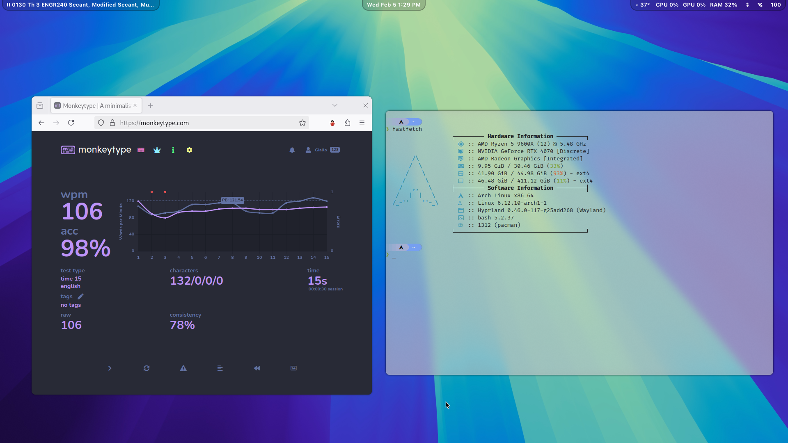

# Arch Linux and Hyprland Config Files

Config files for my desktop system, which I use for school and coding.

## Screenshots (2/9/25)

## What I Use

-   Window Manager - [Hyprland](https://hyprland.org/).
-   Status Bar - [Waybar](https://github.com/Alexays/Waybar).
-   Terminal Emulator - [Alacritty](https://github.com/alacritty/alacritty).
-   Shell Prompt - [Starship](https://starship.rs/).
-   Notification Daemon - [Dunst](https://github.com/dunst-project/dunst).
-   System Info - [Fastfetch](https://github.com/fastfetch-cli/fastfetch).
-   App Launcher - [Rofi](https://github.com/lbonn/rofi).

## Keybinds

I use a combination of Windows, MacOS, and custom keybinds.

### General

| Keys                                              | Action                |
| :------------------------------------------------ | :-------------------- |
| <kbd>Super</kbd>                                  | open/close menu       |
| <kbd>Super</kbd> + <kbd>Q</kbd>                   | open terminal         |
| <kbd>Super</kbd> + <kbd>M</kbd>                   | take screenshot       |
| <kbd>Super</kbd> + <kbd>B</kbd>                   | open/close status bar |
| <kbd>Alt</kbd> + <kbd>Tab</kbd>                   | focus next window     |
| <kbd>Ctrl</kbd> + <kbd>Shift</kbd> + <kbd>W</kbd> | close active window   |

### Window Management

| Keys                            | Action                 |
| :------------------------------ | :--------------------- |
| <kbd>Super</kbd> + <kbd>V</kbd> | toggle floating window |
| <kbd>Super</kbd> + <kbd>P</kbd> | toggle pseudotiling    |
| <kbd>Super</kbd> + <kbd>J</kbd> | toggle split layout    |

### Workspaces

| Keys                                               | Action                             |
| :------------------------------------------------- | :--------------------------------- |
| <kbd>Super</kbd> + <kbd>#</kbd>                    | switch to # workspace              |
| <kbd>Super</kbd> + <kbd>Shift</kbd> + <kbd>#</kbd> | move current window to # workspace |
| <kbd>Super</kbd> + <kbd>Scroll</kbd>               | cycle workspaces                   |
| <kbd>Super</kbd> + <kbd>Left Click</kbd>           | move window                        |
| <kbd>Super</kbd> + <kbd>Right Click</kbd>          | resize window                      |

\* # represents a number (1 - 10), use 0 for workspace 10.

## Helpful Resources

### MATLAB Setup

-   [Blog post](https://heziah.top/posts/notion/arch-linux-wayland-an-zhuang-matlab/) on fixing wayland related issues for MATLAB.

### Secure Boot + GRUB

-   For [setting up GRUB with secure boot](https://www.reddit.com/r/archlinux/comments/10pq74e/my_easy_method_for_setting_up_secure_boot_with/) (needed for dual booting Windows 11).

### Fonts

-   Install fonts: `sudo pacman -Syu $(pacman -Ssq ttf- | grep -v ttf-nerd-fonts-symbols-mono)`
-   [Nerd Fonts cheat sheet](https://www.nerdfonts.com/cheat-sheet)
